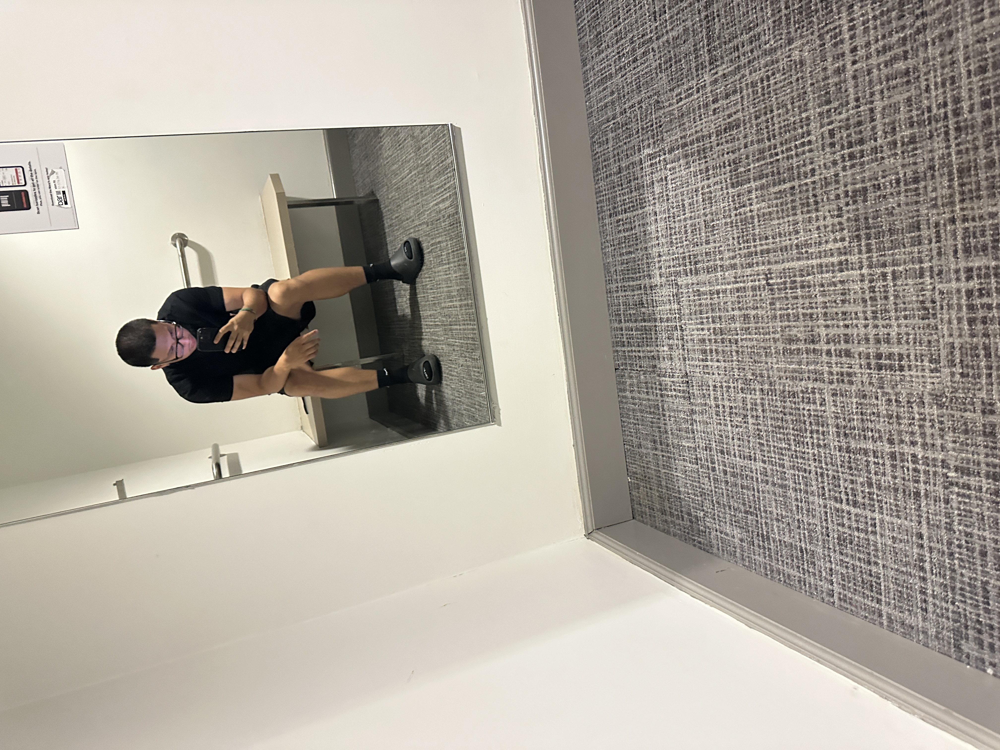
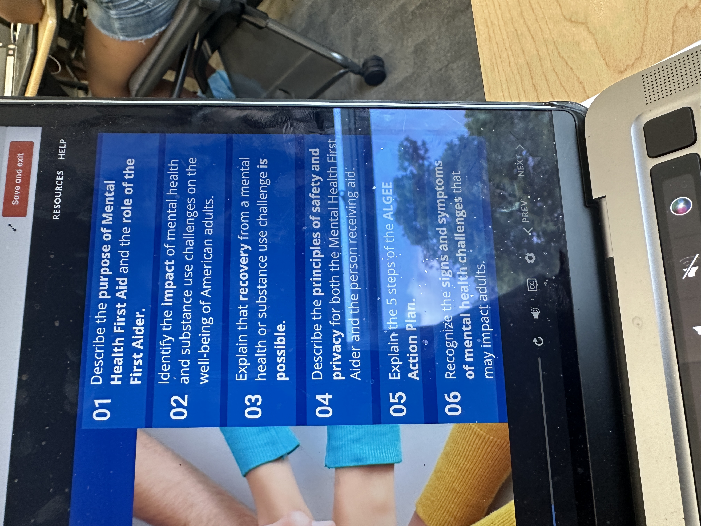
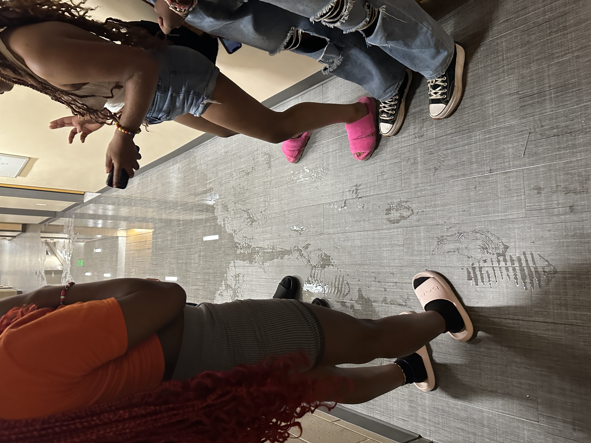
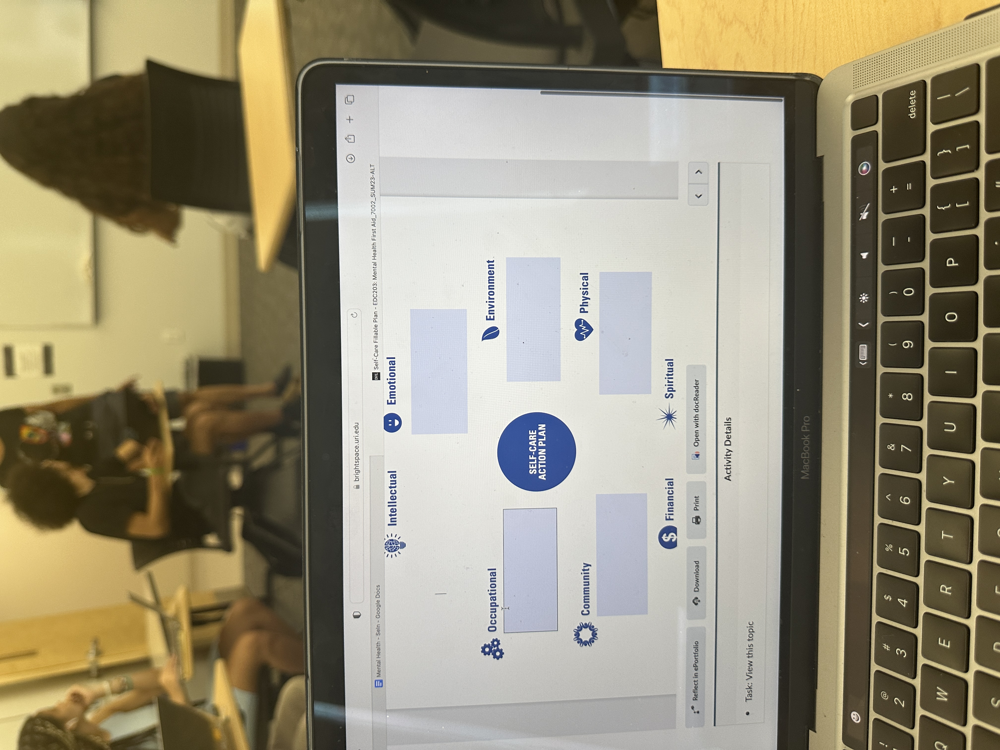
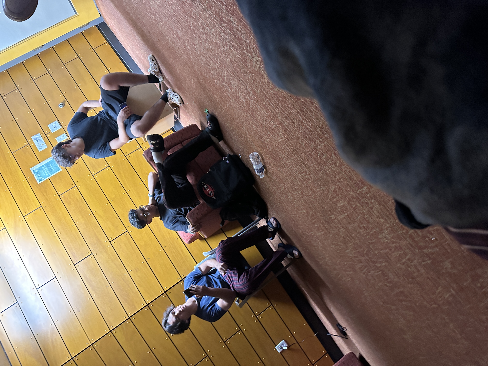
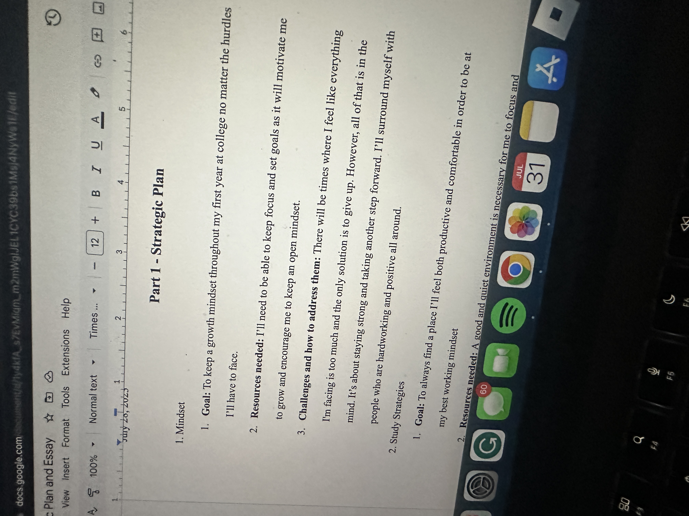
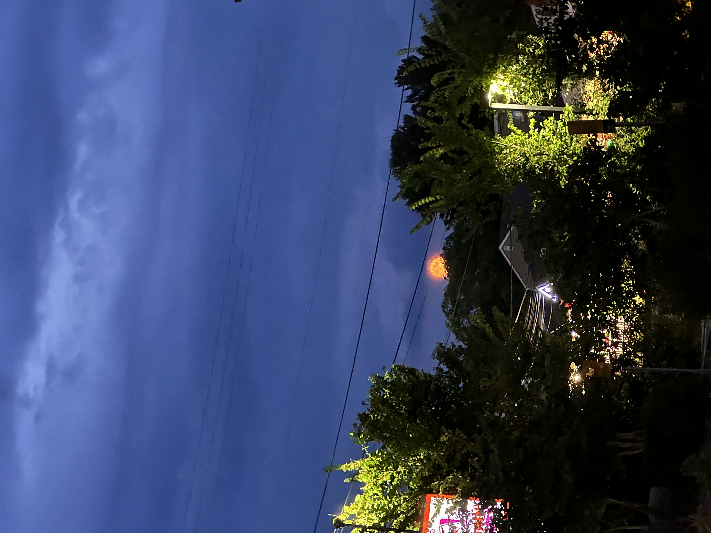
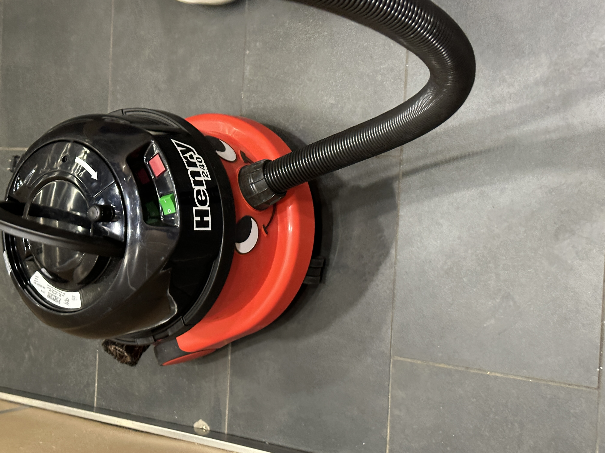
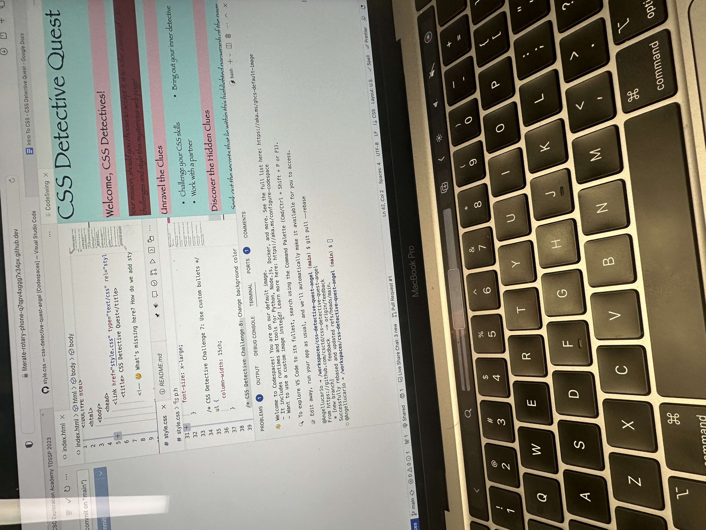
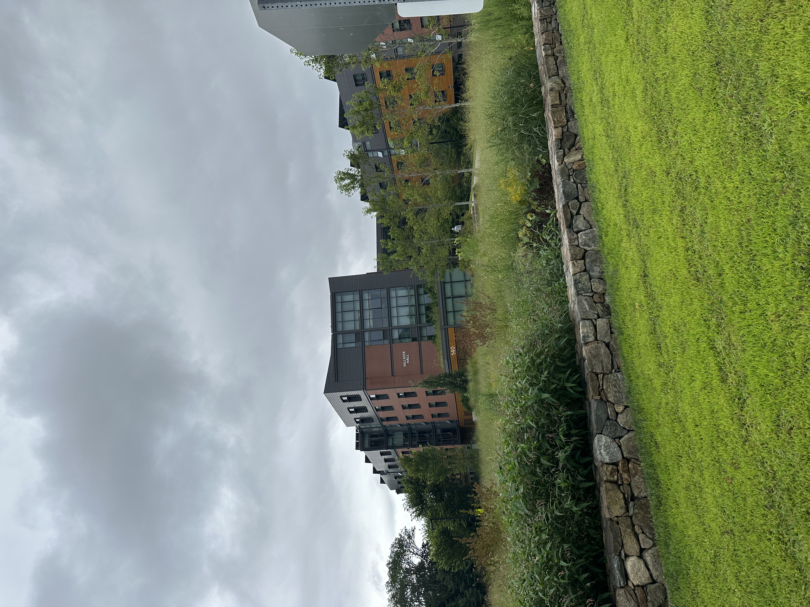

# My Pechakucha Slideshow 

<div id= "slideshow">

```{include} _static/buttons.html
```

```{card} 
:class-card: slide


```

```{card}
:class-card: slide

```


```{card}
:class-card: slide

```

```{card}
:class-card: slide

```

```{card}
:class-card: slide

```

```{card}
:class-card: slide

```

```{card}
:class-card: slide

```

```{card}
:class-card: slide

```

```{card}
:class-card: slide

```


```{card}
:class-card: slide

```


```{card}
:class-card: slide

```

```{card}
:class-card: slide

```

```{card}
:class-card: slide

```

```{card}
:class-card: slide

```

```{card}
:class-card: slide

```


```{card}
:class-card: slide

```

```{card}
:class-card: slide

```

```{card}
:class-card: slide

```

```{card}
:class-card: slide

```

```{card}
:class-card: slide

```

```{card}
:class-card: slide

```

```{card}
:class-card: slide

```
<div>

